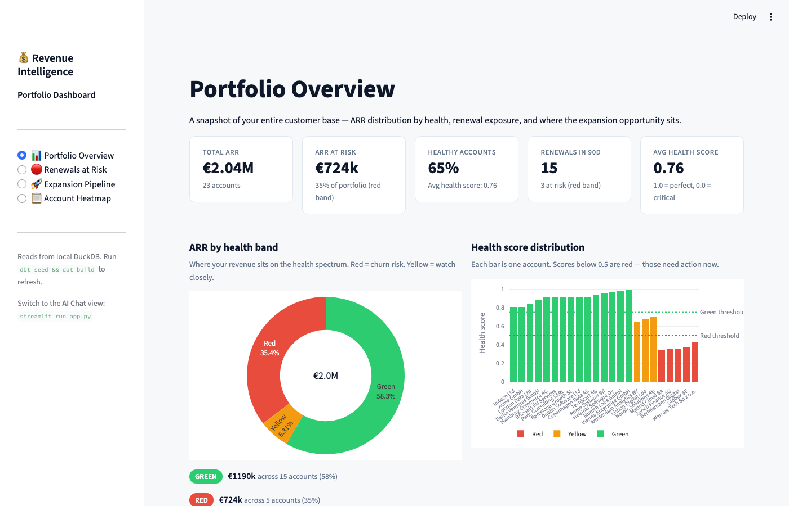
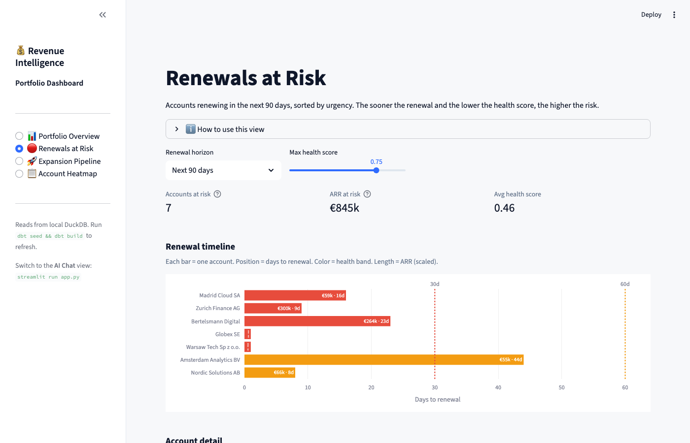
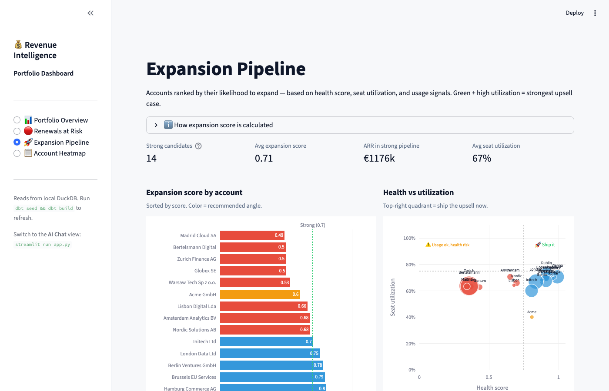
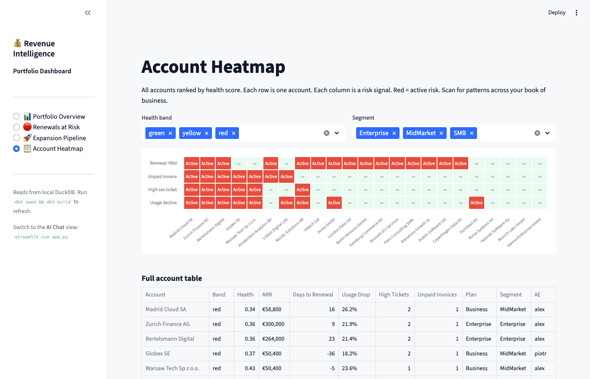
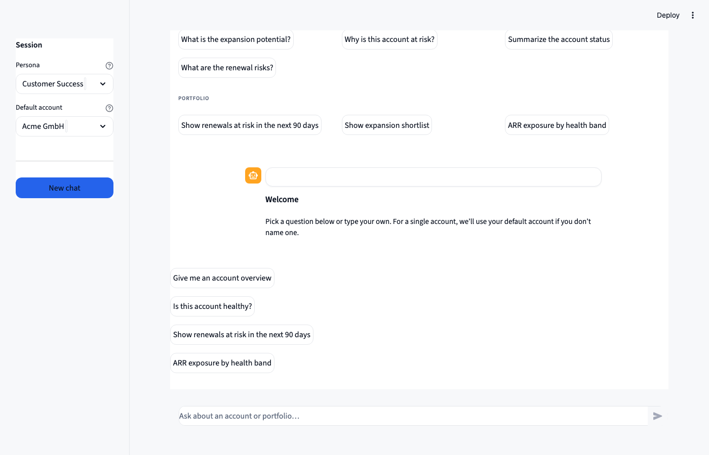

# Revenue Intelligence Agent

> A governance-first AI demo for Customer Success teams — built on warehouse signals, not gut feeling.

[](#)
[](#)
[](#)
[](#)

---

## Two views, two audiences

The project ships two Streamlit interfaces that complement each other.

### 📊 Portfolio Dashboard — for CS leadership and AEs

A static analytics view of the full customer book. No chat required — just actionable signals at a glance.

```bash
streamlit run dashboard.py   # or: make dashboard
```

**Portfolio Overview** — ARR by health band, health score distribution, risk driver breakdown.



**Renewals at Risk** — accounts renewing in the next 90 days, ranked by urgency. Gantt-style timeline + detail table.



**Expansion Pipeline** — accounts ranked by expansion score. Health vs utilisation scatter to identify the "ship it now" quadrant.



**Account Heatmap** — all accounts in one view. Each row = one account, each column = a risk signal (usage decline, unpaid invoices, high-severity tickets, renewal <90d). Filter by band or segment.



---

### 💬 AI Chat — for CSMs asking account-level questions

A conversational interface backed by governed SQL templates. Pick a question or type your own — the agent routes it to a validated query and returns a business-language explanation.

```bash
streamlit run app.py   # or: make app
```



---

## The problem this solves

Most AI demos aimed at revenue teams share a common flaw: they let an LLM query raw CRM tables without guardrails, then present the output as truth. The result is confident, fast, and frequently wrong.

This project takes the opposite approach. The AI layer is narrow and governed. It can only query a curated set of pre-validated analytics assets. Every query is validated before execution. Every result comes with a business-language explanation, not just a number.

The architecture mirrors how this would work in production at a B2B SaaS company: warehouse as source of truth, dbt models as the contract layer, and AI as a read-only signal amplifier — never a data mutator.

---

## Architecture

```
Seed data (customers · subscriptions · invoices · usage · tickets)
    ↓
dbt gold layer
    ├── dm_account_overview        — account master with ARR, segment, plan
    ├── fct_account_health_score   — deterministic health scoring (usage + tickets + payment + renewal)
    ├── ai_fct_expansion_shortlist — expansion candidates ranked by score
    └── ai_arr_exposure            — ARR exposure by health band
    ↓
dim_ai_allowed_assets              — semantic contract (allowlist)
    ↓
SQL guardrail                      — validates intent, table refs, query shape
    ↓
AI query runner                    — intent → template → validated SQL → result → explanation
    ↓
Streamlit UI (chat + dashboard)    — CS-facing interfaces
```

**Key design decisions:**
- `SELECT *` is blocked at the guardrail layer
- Only `SELECT` statements are permitted — no mutations
- Every asset in the allowlist has a defined grain and business description
- Health scoring is deterministic and explainable (no black-box LLM scoring)
- Health score = 1 − (0.35 × usage risk + 0.25 × ticket risk + 0.25 × payment risk + 0.15 × renewal risk)

---

## Health score model

| Signal | Weight | Triggers |
|---|---|---|
| Usage decline | 35% | 30-day active user drop > 15% |
| High-severity tickets | 25% | ≥ 1 high-sev ticket open |
| Unpaid invoices | 25% | Any unpaid invoice |
| Renewal proximity | 15% | Renewal in ≤ 60 days |

Scores map to bands: **green** (≥ 0.75), **yellow** (0.5–0.75), **red** (< 0.5).

---

## Supported AI chat queries

| Intent | Example |
|---|---|
| Account overview | *"Give me an overview for Acme GmbH"* |
| Health assessment | *"Is this account healthy?"* |
| Expansion potential | *"What's the expansion potential?"* |
| Renewal risk | *"What are the renewal risks?"* |
| Portfolio view | *"Show renewals at risk in the next 90 days"* |
| ARR exposure | *"ARR exposure by health band"* |

The intent router maps natural-language questions to parameterised SQL templates — not free-form LLM SQL generation. Parameterised templates are auditable, testable, and safe.

---

## Quick start

```bash
python3 -m venv .venv
.venv/bin/pip install -r requirements.txt

make deps   # install dbt packages
make seed   # load seed data
make build  # run all dbt models

make dashboard   # Portfolio Dashboard → http://localhost:8501
make app         # AI Chat interface → http://localhost:8501
```

Or run manually:
```bash
.venv/bin/streamlit run dashboard.py
.venv/bin/streamlit run app.py
```

---

## Project structure

```
revenue-intelligence-agent/
├── dbt/
│   ├── seeds/              # Demo data: customers, subscriptions, invoices, usage, tickets
│   ├── models/
│   │   ├── gold/           # Fact and dimensional models (the analytics contract)
│   │   ├── ai/             # AI-safe views (read-only, stripped PII)
│   │   └── semantic/       # dim_ai_allowed_assets — the allowlist
│   └── profiles.yml
├── scripts/
│   ├── ai_sql_guard.py     # Table extraction + allowlist validation
│   ├── ai_intents.py       # Intent → SQL template mapping
│   ├── ai_interpreter.py   # Result → business-language explanation
│   └── ai_query_runner.py  # Orchestrator
├── docs/screenshots/       # Dashboard and chat screenshots
├── .streamlit/
│   └── config.toml         # Light theme config
├── app.py                  # AI Chat Streamlit interface
├── dashboard.py            # Portfolio Dashboard Streamlit interface
├── Makefile
└── README.md
```

---

## Why this architecture matters

The pattern here — **allowlist → guardrail → governed query → explainable result** — is the same pattern that makes ML model outputs trustworthy at production scale. A customer health score is only useful if a CS manager actually acts on it. That requires explainability and auditability, not just accuracy.

This project is a concrete demo of that principle applied to an AI-assisted CS workflow.

---

## Related work

This project is part of a larger GTM analytics engineering portfolio:

- [Experimentation Analytics Platform](https://github.com/PZawieja/experimentation-analytics-platform) — A/B testing pipeline with statistical guardrails
- [Air Traffic Pulse](https://github.com/PZawieja/air-traffic-pulse) — Anomaly detection on live data streams
- [Event Analytics Platform](https://github.com/PZawieja/event-analytics-platform) — Behavioural event pipeline
