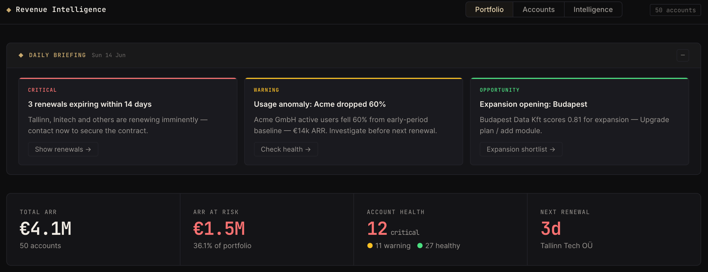
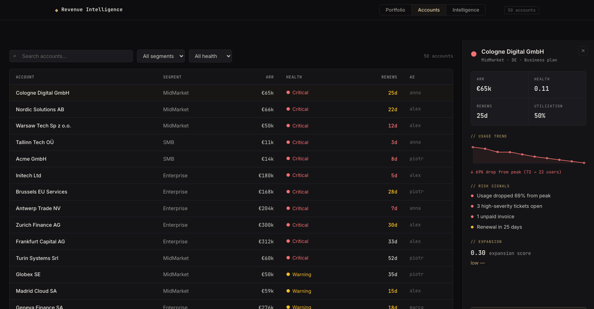
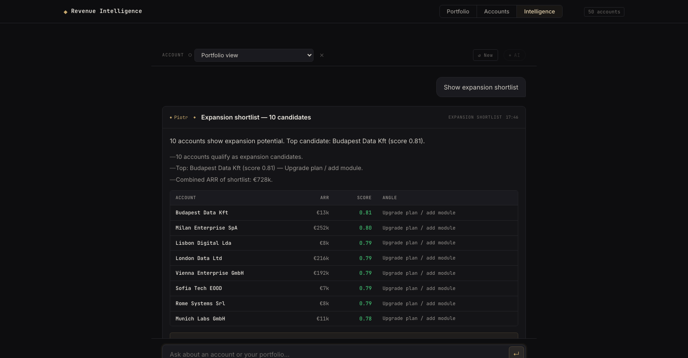

# Revenue Intelligence Agent

**The AI-powered Customer Success co-pilot that turns your renewal pipeline into proactive action — not reactive firefighting.**

Built for RevOps and CS teams managing B2B SaaS portfolios. Surfaces churn risk, flags usage anomalies, and generates copy-pasteable outreach assets — all from a single, fast, locally-running application.

**Build log:** [goldlayer.dev/writing/revenue-intelligence-agent-ai-cs-copilot](https://goldlayer.dev/writing/revenue-intelligence-agent-ai-cs-copilot.html)







---

## Value Proposition

Most CS dashboards show you what happened. This one tells you **what to do about it — today**.

- **Daily Briefing** auto-generates 3 prioritised AI insights every morning (no query needed)
- **Usage anomaly detection** flags accounts with statistically significant activity drops before they churn
- **Natural language intelligence** answers portfolio questions in plain English and shows the exact SQL it ran
- **One-click action assets** draft follow-up emails, Slack alerts, and CRM notes from any AI response
- **Zero infrastructure** — DuckDB runs embedded, no warehouse or streaming pipeline required

---

## Architecture

```
┌─────────────────────────────────────────────────────────────────┐
│                         Browser SPA                             │
│  ┌──────────────┐  ┌──────────────┐  ┌───────────────────────┐ │
│  │  Portfolio   │  │   Accounts   │  │  Intelligence (Chat)  │ │
│  │  + Briefing  │  │  Drilldown   │  │  + Action Assets      │ │
│  └──────┬───────┘  └──────┬───────┘  └──────────┬────────────┘ │
└─────────┼─────────────────┼─────────────────────┼──────────────┘
          │                 │                     │
          ▼                 ▼                     ▼
┌─────────────────────────────────────────────────────────────────┐
│                      FastAPI (Python)                           │
│  /api/portfolio   /api/accounts   /api/chat   /api/briefing     │
│  /api/action-asset                                              │
│                                                                 │
│  core/intent.py        — rapidfuzz NL intent detection          │
│  core/llm.py           — Claude API: insights, assets, chat     │
│  core/guardrails.py    — SQL allowlist + PII safety checks      │
│  core/interpreters.py  — deterministic fallback renderers       │
└──────────────────────────────┬──────────────────────────────────┘
                               │
                               ▼
┌─────────────────────────────────────────────────────────────────┐
│                       DuckDB (embedded)                         │
│                                                                 │
│  dbt/seeds/              — 50 synthetic B2B SaaS accounts       │
│  dbt/models/gold/        — health scoring, ARR, renewals        │
│  dbt/models/ai/          — AI-safe views (allowlisted assets)   │
│  dbt/models/semantic/    — dim_ai_allowed_assets (SQL guard)    │
└─────────────────────────────────────────────────────────────────┘
                               │
                         claude-sonnet-4-6
                         (optional — falls back
                          to deterministic mode)
```

---

## Feature Highlights

### Daily Briefing (Proactive CSM Panel)
Loads automatically on the Portfolio view. Three AI-generated insight cards — one Critical, one Warning, one Opportunity — each with a one-click action that fires the relevant Intelligence query. Falls back to heuristic insights when no AI key is present.

### Portfolio Intelligence Dashboard
- **KPI strip** — Total ARR, ARR at Risk, health distribution, next renewal countdown (with inline tooltips explaining each metric)
- **Health donut** + **ARR-by-band bar chart** + **stacked renewal pipeline** — 6-month forward view
- **Renewals 90-day list** + **full account risk matrix** — both with row-limit controls

### Account Drilldown
Click any row in the Accounts table to open an instant side panel: usage sparkline (coloured by drop severity), risk signals, expansion score, and "Ask Intelligence →" that carries the account context into the chat view.

### Intelligence Agent (Natural Language Chat)
Type any question in plain English. Intent detection maps it to one of six SQL templates. If `ANTHROPIC_API_KEY` is set, Claude generates a narrative, bullet points, and a next action. Every response shows an expandable Evidence accordion with the exact SQL and guardrail badges (SELECT-only · Allowlisted · No PII · Row limit).

### Next-Best-Action Assets
After any AI response, three buttons appear — **→ Email draft**, **# Slack alert**, **≡ CRM note**. One click calls Claude with the account context and returns a copy-pasteable asset inline. No modal, no page change, no clipboard gymnastics.

### Usage Anomaly Detection
Compares early-period active-user averages against recent-period averages for every account with sufficient data. Accounts with >30% drops surface automatically in the Daily Briefing and can be interrogated directly via the Intelligence agent.

---

## Stack

| Layer | Technology |
|---|---|
| Warehouse | DuckDB 1.x (embedded, no server) |
| Transformation | dbt-duckdb |
| Backend | FastAPI + Pydantic |
| NL Intent | rapidfuzz (no LLM needed for routing) |
| AI Narrative | Anthropic Claude `claude-sonnet-4-6` (optional) |
| Frontend | Vanilla HTML/CSS/JS + Chart.js 4 |
| Runtime | Python 3.12 + uv |

---

## Quickstart

### Prerequisites
- Python 3.12+
- [uv](https://docs.astral.sh/uv/) (`brew install uv` on macOS)

### 1 — Install dependencies

```bash
git clone <repo-url>
cd revenue-intelligence-agent
uv sync
```

### 2 — Configure environment

```bash
cp .env.example .env
```

Edit `.env`:

```dotenv
# Optional — enables AI narrative generation and action assets
ANTHROPIC_API_KEY=sk-ant-...
```

The app runs fully without an API key. All queries execute deterministically; AI narrative is bypassed.

### 3 — Build the data layer

```bash
make deps    # installs dbt packages
make seed    # loads seed CSVs into DuckDB
make build   # runs all dbt models
```

### 4 — Start the server

```bash
make app
# → http://localhost:8000
```

### What to try first

1. **Portfolio** loads instantly — check the Daily Briefing cards at the top
2. Click any Briefing action button to fire an Intelligence query automatically
3. Open **Accounts** → click a Critical row → review usage sparkline + signals → click "Ask Intelligence →"
4. In **Intelligence**, ask: *"Is Initech Ltd healthy?"* or *"Show expansion shortlist"*
5. After any AI response, click **→ Email draft** to generate a copy-pasteable outreach email

---

## Data Model

All data is synthetic — 50 European B2B SaaS accounts across SMB / Mid-Market / Enterprise segments with realistic health signal variety.

```
seeds/
  customers.csv          → 50 accounts with segment, country, AE
  subscriptions.csv      → plans, ARR, renewal dates
  invoices.csv           → payment history (source of unpaid_invoices signal)
  product_usage_daily.csv → 10 data points per account over 5 months
  support_tickets.csv    → high-severity ticket counts

gold/ (dbt models)
  fct_account_health_score      → composite score from 4 risk signals
  fct_account_expansion_potential → seat utilisation + health-gated score
  fct_renewals_at_risk          → renewal date + health join
  dm_account_overview           → denormalised account master

ai/ (AI-safe views)
  ai_*                   → re-expose gold models under allowlisted names
  dim_ai_allowed_assets  → SQL guardrail: only these models are queryable via chat
```

---

## Development

```bash
make lint    # ruff check
make test    # pytest (if tests present)
make dbt-docs  # generate + serve dbt docs
```

The dbt profile (`dbt/profiles.yml`) points to `duckdb/revenue_intel.duckdb`. The FastAPI server reads the same file via `core/db.py`.
